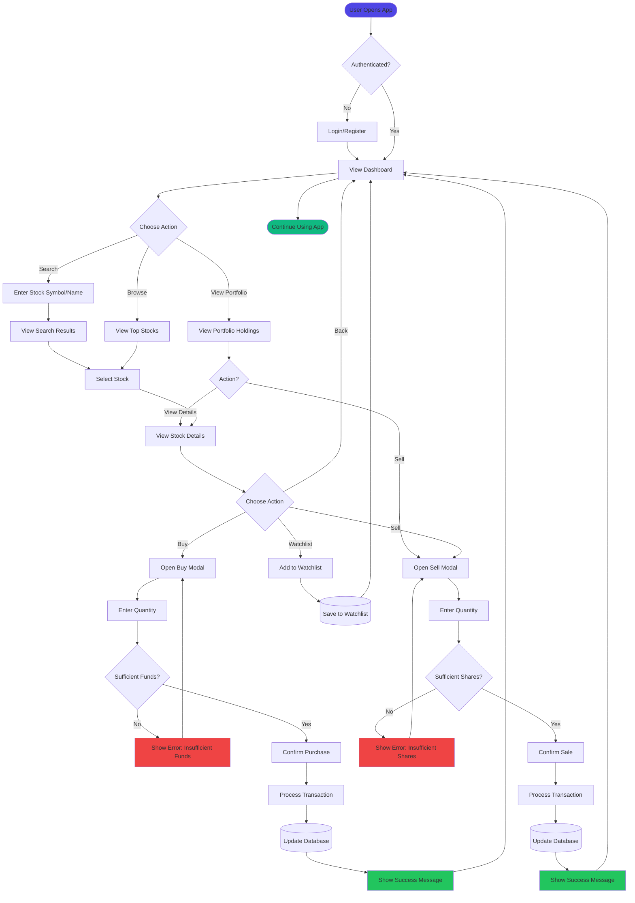
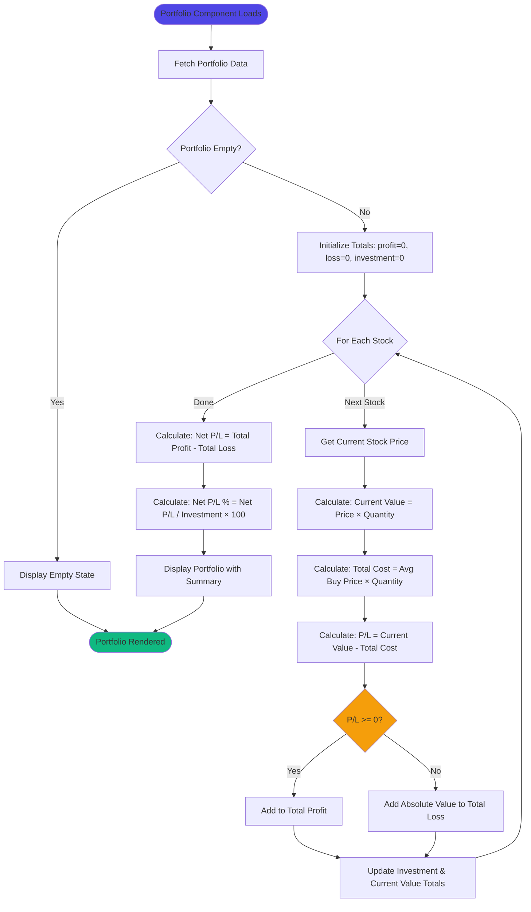
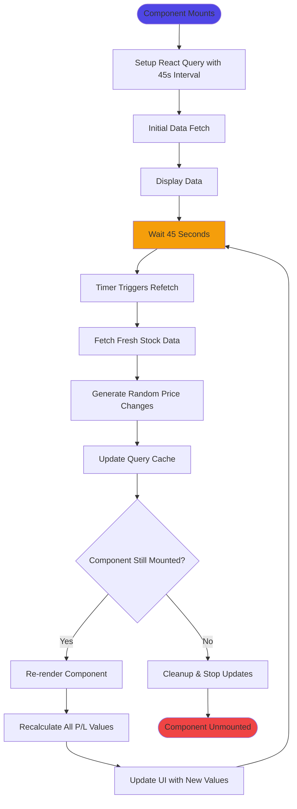

# Activity Diagrams

## 1. Stock Trading Activity Flow

```mermaid
flowchart TD
    Start([User Opens App]) --> CheckAuth{Authenticated?}
    CheckAuth -->|No| Login[Login/Register]
    Login --> Dashboard[View Dashboard]
    CheckAuth -->|Yes| Dashboard
    
    Dashboard --> Action{Choose Action}
    
    Action -->|Search| Search[Enter Stock Symbol/Name]
    Search --> Results[View Search Results]
    Results --> SelectStock[Select Stock]
    
    Action -->|View Portfolio| Portfolio[View Portfolio Holdings]
    Portfolio --> PortfolioAction{Action?}
    PortfolioAction -->|View Details| StockDetails
    PortfolioAction -->|Sell| SellFlow
    
    Action -->|Browse| Browse[View Top Stocks]
    Browse --> SelectStock
    
    SelectStock --> StockDetails[View Stock Details]
    StockDetails --> StockAction{Choose Action}
    
    StockAction -->|Buy| BuyFlow[Open Buy Modal]
    StockAction -->|Sell| SellFlow[Open Sell Modal]
    StockAction -->|Watchlist| AddWatch[Add to Watchlist]
    StockAction -->|Back| Dashboard
    
    BuyFlow --> EnterQty[Enter Quantity]
    EnterQty --> CheckFunds{Sufficient Funds?}
    CheckFunds -->|No| ErrorFunds[Show Error: Insufficient Funds]
    ErrorFunds --> BuyFlow
    CheckFunds -->|Yes| ConfirmBuy[Confirm Purchase]
    ConfirmBuy --> ProcessBuy[Process Transaction]
    ProcessBuy --> UpdateDB[(Update Database)]
    UpdateDB --> SuccessBuy[Show Success Message]
    SuccessBuy --> Dashboard
    
    SellFlow --> EnterSellQty[Enter Quantity]
    EnterSellQty --> CheckHoldings{Sufficient Shares?}
    CheckHoldings -->|No| ErrorShares[Show Error: Insufficient Shares]
    ErrorShares --> SellFlow
    CheckHoldings -->|Yes| ConfirmSell[Confirm Sale]
    ConfirmSell --> ProcessSell[Process Transaction]
    ProcessSell --> UpdateDB2[(Update Database)]
    UpdateDB2 --> SuccessSell[Show Success Message]
    SuccessSell --> Dashboard
    
    AddWatch --> SaveWatch[(Save to Watchlist)]
    SaveWatch --> Dashboard
    
    Dashboard --> End([Continue Using App])
    
    style Start fill:#4f46e5
    style End fill:#10b981
    style ErrorFunds fill:#ef4444
    style ErrorShares fill:#ef4444
    style SuccessBuy fill:#22c55e
    style SuccessSell fill:#22c55e
```

## 2. Portfolio Value Calculation Activity

```mermaid
flowchart TD
    Start([Portfolio Component Loads]) --> Fetch[Fetch Portfolio Data]
    Fetch --> CheckEmpty{Portfolio Empty?}
    
    CheckEmpty -->|Yes| ShowEmpty[Display Empty State]
    ShowEmpty --> End
    
    CheckEmpty -->|No| Init[Initialize Totals: profit=0, loss=0, investment=0]
    Init --> Loop{For Each Stock}
    
    Loop -->|Next Stock| GetPrice[Get Current Stock Price]
    GetPrice --> CalcValue[Calculate: Current Value = Price × Quantity]
    CalcValue --> CalcCost[Calculate: Total Cost = Avg Buy Price × Quantity]
    CalcCost --> CalcPL[Calculate: P/L = Current Value - Total Cost]
    
    CalcPL --> CheckPL{P/L >= 0?}
    CheckPL -->|Yes| AddProfit[Add to Total Profit]
    CheckPL -->|No| AddLoss[Add Absolute Value to Total Loss]
    
    AddProfit --> UpdateTotals
    AddLoss --> UpdateTotals[Update Investment & Current Value Totals]
    UpdateTotals --> Loop
    
    Loop -->|Done| CalcNet[Calculate: Net P/L = Total Profit - Total Loss]
    CalcNet --> CalcPercent[Calculate: Net P/L % = Net P/L / Investment × 100]
    CalcPercent --> Display[Display Portfolio with Summary]
    Display --> End([Portfolio Rendered])
    
    style Start fill:#4f46e5
    style End fill:#10b981
    style CheckPL fill:#f59e0b
```

## 3. Real-time Data Update Activity

```mermaid
flowchart TD
    Start([Component Mounts]) --> Setup[Setup React Query with 45s Interval]
    Setup --> InitFetch[Initial Data Fetch]
    InitFetch --> Display[Display Data]
    
    Display --> Wait[Wait 45 Seconds]
    Wait --> Trigger[Timer Triggers Refetch]
    Trigger --> FetchNew[Fetch Fresh Stock Data]
    FetchNew --> GenPrice[Generate Random Price Changes]
    GenPrice --> UpdateCache[Update Query Cache]
    UpdateCache --> CheckMount{Component Still Mounted?}
    
    CheckMount -->|Yes| Rerender[Re-render Component]
    Rerender --> RecalcPL[Recalculate All P/L Values]
    RecalcPL --> UpdateUI[Update UI with New Values]
    UpdateUI --> Wait
    
    CheckMount -->|No| Cleanup[Cleanup & Stop Updates]
    Cleanup --> End([Component Unmounted])
    
    style Start fill:#4f46e5
    style End fill:#ef4444
    style Wait fill:#f59e0b
```
