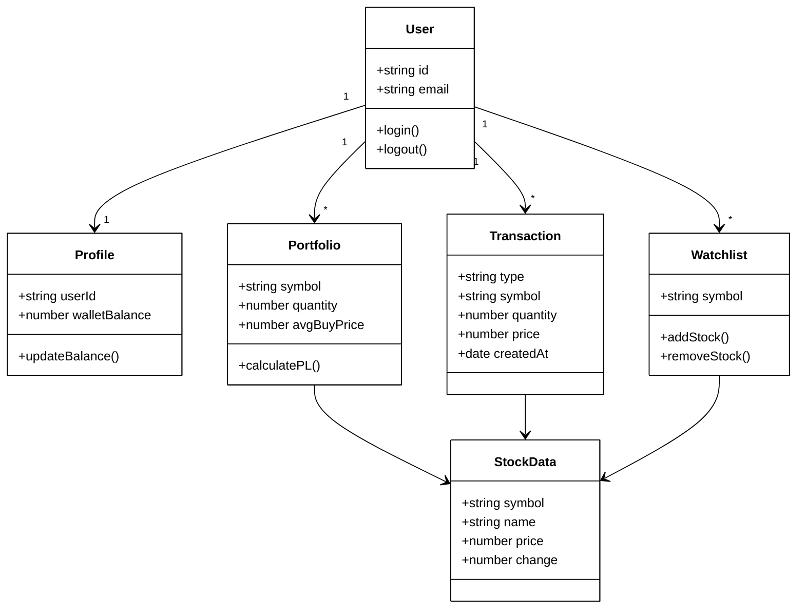

# Class Diagram

This diagram shows the component structure and relationships in the Fingrow platform.

## Component Dependencies

### Core Components
- **App**: Root component that provides contexts and routing
- **AuthContext**: Manages user authentication state
- **ThemeContext**: Manages light/dark theme
- **SupabaseClient**: Database and authentication client

### Page Components
- **Dashboard**: Main page with stock search and details
- **Portfolio**: Portfolio management page
- **Home**: Landing page with navigation cards
- **Auth**: Login/Register page
- **NewsPage**: Market news page

### Feature Components
- **Header**: Navigation bar with user menu
- **WalletCard**: Displays wallet balance
- **StockSearch**: Search functionality
- **StockDetails**: Detailed stock information
- **Portfolio**: Holdings list with P/L calculations
- **TradeModal**: Buy/Sell transaction interface
- **Watchlist**: Monitored stocks list
- **TopStocks**: Popular stocks display
- **NewsSection**: Latest market news

### Data Models
- **StockData**: Stock information structure
- **PortfolioItem**: User's stock holdings
- **Transaction**: Trade history record
- **WatchlistItem**: Watched stock reference
- **Profile**: User profile with wallet balance
