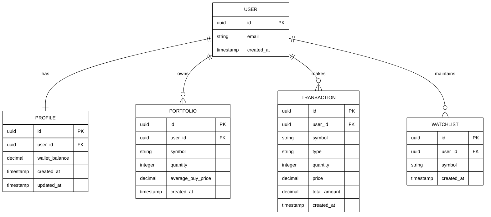

# Entity Relationship Diagram

This diagram shows the database structure and relationships in the Fingrow platform.

## Entity Descriptions

### USER
- Core authentication entity managed by the system
- Each user has a unique email address

### PROFILE
- Stores user's wallet balance and trading account information
- One-to-one relationship with USER
- Initial balance is ₹100,000

### PORTFOLIO
- Tracks all stock holdings for each user
- Stores quantity and average purchase price
- User can own multiple stocks

### TRANSACTION
- Records all buy and sell transactions
- Type can be 'buy' or 'sell'
- Maintains complete trading history

### WATCHLIST
- Allows users to monitor stocks without owning them
- Users can add multiple stocks to track
