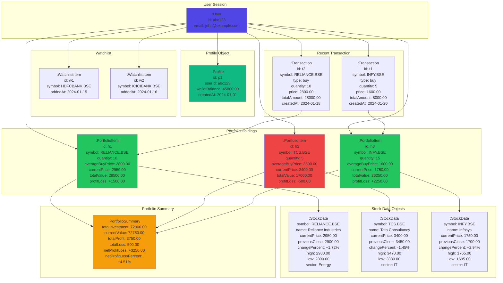

# Object Diagram

This diagram shows specific instances of objects and their relationships at runtime.

## Scenario: User viewing portfolio with active holdings

## Object Instance Details

### User Objects
- **user1**: Active user session for John
- **profile1**: User's profile with wallet balance of ₹45,000

### Portfolio Holdings
- **holding1**: Reliance Industries - 10 shares at profit of ₹1,500
- **holding2**: Tata Consultancy - 5 shares at loss of ₹500
- **holding3**: Infosys - 15 shares at profit of ₹2,250

### Stock Data
- **stock1**: Current market data for Reliance Industries
- **stock2**: Current market data for TCS
- **stock3**: Current market data for Infosys

### Watchlist
- **watch1**: HDFC Bank added to watchlist
- **watch2**: ICICI Bank added to watchlist

### Transactions
- **trans1**: Recent purchase of 5 Infosys shares
- **trans2**: Recent purchase of 10 Reliance shares

### Summary
- **summary**: Aggregated portfolio metrics showing overall performance
- Total investment: ₹72,000
- Current value: ₹72,750
- Net profit: ₹3,250 (+4.51%)

## Object Relationships

1. **User → Profile**: One-to-one relationship
2. **User → Portfolio Items**: One-to-many relationship
3. **Portfolio Items → Stock Data**: Many-to-one relationship (current prices)
4. **User → Watchlist**: One-to-many relationship
5. **User → Transactions**: One-to-many relationship
6. **Transactions → Portfolio Items**: Creates or updates holdings
7. **Portfolio Items → Summary**: Aggregates into summary statistics
