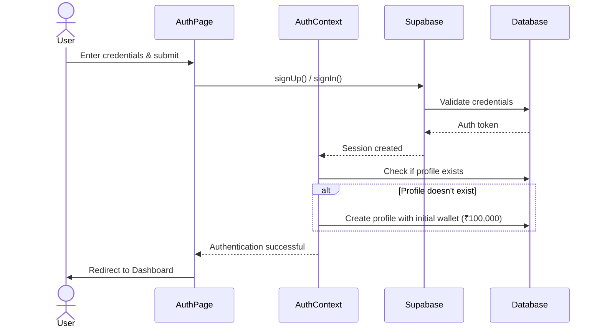
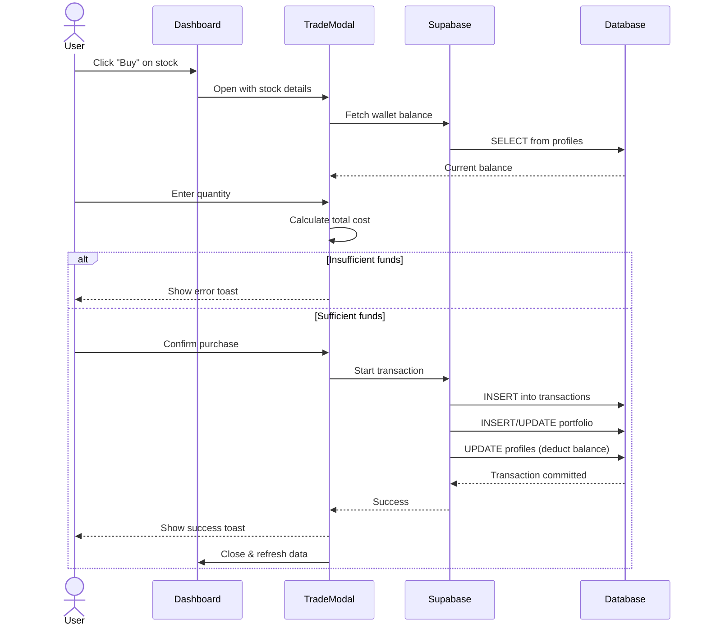
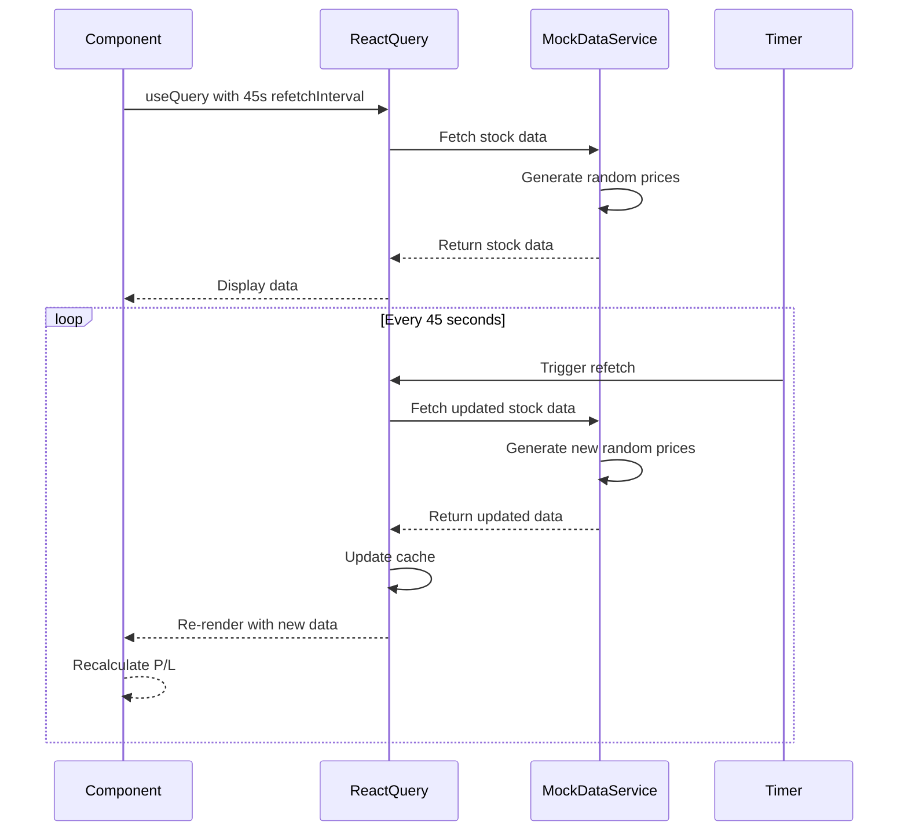
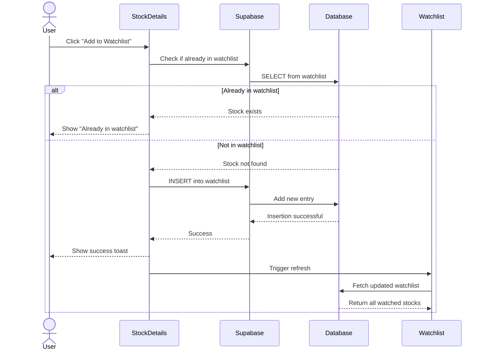
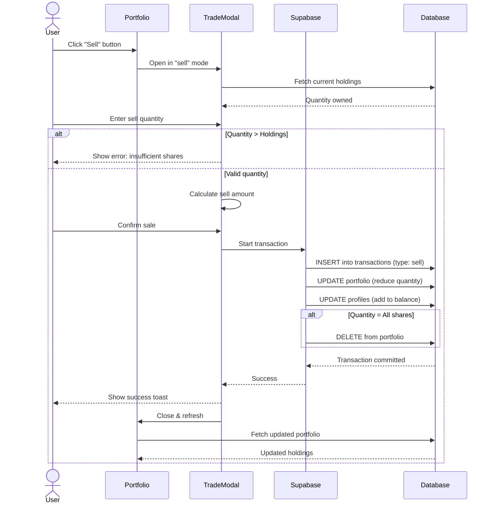

# Sequence Diagrams

## 1. User Authentication Flow

```mermaid
sequenceDiagram
    actor User
    participant AuthPage
    participant AuthContext
    participant Supabase
    participant Database
    
    User->>AuthPage: Enter credentials & submit
    AuthPage->>Supabase: signUp() / signIn()
    Supabase->>Database: Validate credentials
    Database-->>Supabase: Auth token
    Supabase-->>AuthContext: Session created
    AuthContext->>Database: Check if profile exists
    alt Profile doesn't exist
        AuthContext->>Database: Create profile with initial wallet (₹100,000)
    end
    AuthContext-->>AuthPage: Authentication successful
    AuthPage->>User: Redirect to Dashboard
```

## 2. Stock Purchase Flow

```mermaid
sequenceDiagram
    actor User
    participant Dashboard
    participant TradeModal
    participant Supabase
    participant Database
    
    User->>Dashboard: Click "Buy" on stock
    Dashboard->>TradeModal: Open with stock details
    TradeModal->>Supabase: Fetch wallet balance
    Supabase->>Database: SELECT from profiles
    Database-->>TradeModal: Current balance
    User->>TradeModal: Enter quantity
    TradeModal->>TradeModal: Calculate total cost
    alt Insufficient funds
        TradeModal-->>User: Show error toast
    else Sufficient funds
        User->>TradeModal: Confirm purchase
        TradeModal->>Supabase: Start transaction
        Supabase->>Database: INSERT into transactions
        Supabase->>Database: INSERT/UPDATE portfolio
        Supabase->>Database: UPDATE profiles (deduct balance)
        Database-->>Supabase: Transaction committed
        Supabase-->>TradeModal: Success
        TradeModal-->>User: Show success toast
        TradeModal->>Dashboard: Close & refresh data
    end
```

## 3. Portfolio Real-time Update Flow

```mermaid
sequenceDiagram
    participant Component
    participant ReactQuery
    participant MockDataService
    participant Timer
    
    Component->>ReactQuery: useQuery with 45s refetchInterval
    ReactQuery->>MockDataService: Fetch stock data
    MockDataService->>MockDataService: Generate random prices
    MockDataService-->>ReactQuery: Return stock data
    ReactQuery-->>Component: Display data
    
    loop Every 45 seconds
        Timer->>ReactQuery: Trigger refetch
        ReactQuery->>MockDataService: Fetch updated stock data
        MockDataService->>MockDataService: Generate new random prices
        MockDataService-->>ReactQuery: Return updated data
        ReactQuery->>ReactQuery: Update cache
        ReactQuery-->>Component: Re-render with new data
        Component-->>Component: Recalculate P/L
    end
```

## 4. Watchlist Management Flow

```mermaid
sequenceDiagram
    actor User
    participant StockDetails
    participant Supabase
    participant Database
    participant Watchlist
    
    User->>StockDetails: Click "Add to Watchlist"
    StockDetails->>Supabase: Check if already in watchlist
    Supabase->>Database: SELECT from watchlist
    
    alt Already in watchlist
        Database-->>StockDetails: Stock exists
        StockDetails-->>User: Show "Already in watchlist"
    else Not in watchlist
        Database-->>StockDetails: Stock not found
        StockDetails->>Supabase: INSERT into watchlist
        Supabase->>Database: Add new entry
        Database-->>Supabase: Insertion successful
        Supabase-->>StockDetails: Success
        StockDetails-->>User: Show success toast
        StockDetails->>Watchlist: Trigger refresh
        Watchlist->>Database: Fetch updated watchlist
        Database-->>Watchlist: Return all watched stocks
    end
```

## 5. Sell Stock Flow

```mermaid
sequenceDiagram
    actor User
    participant Portfolio
    participant TradeModal
    participant Supabase
    participant Database
    
    User->>Portfolio: Click "Sell" button
    Portfolio->>TradeModal: Open in "sell" mode
    TradeModal->>Database: Fetch current holdings
    Database-->>TradeModal: Quantity owned
    User->>TradeModal: Enter sell quantity
    
    alt Quantity > Holdings
        TradeModal-->>User: Show error: insufficient shares
    else Valid quantity
        TradeModal->>TradeModal: Calculate sell amount
        User->>TradeModal: Confirm sale
        TradeModal->>Supabase: Start transaction
        Supabase->>Database: INSERT into transactions (type: sell)
        Supabase->>Database: UPDATE portfolio (reduce quantity)
        Supabase->>Database: UPDATE profiles (add to balance)
        
        alt Quantity = All shares
            Supabase->>Database: DELETE from portfolio
        end
        
        Database-->>Supabase: Transaction committed
        Supabase-->>TradeModal: Success
        TradeModal-->>User: Show success toast
        TradeModal->>Portfolio: Close & refresh
        Portfolio->>Database: Fetch updated portfolio
        Database-->>Portfolio: Updated holdings
    end
```
