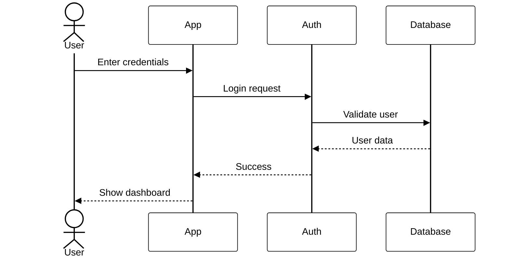
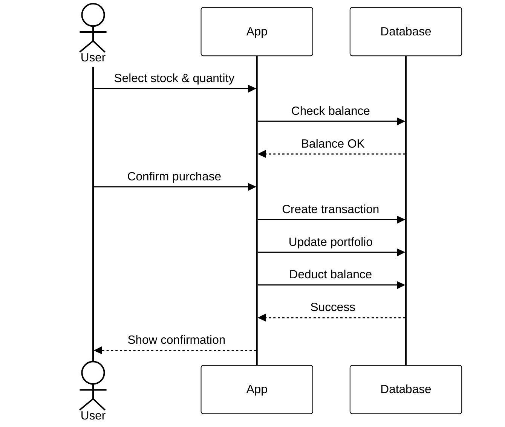
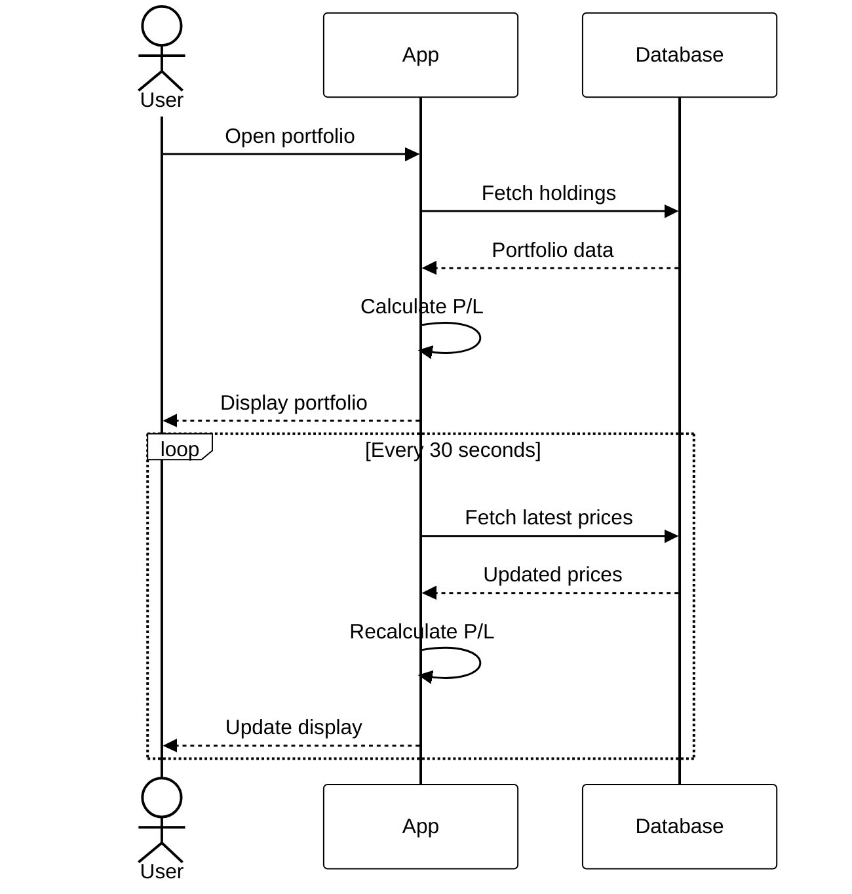

# Sequence Diagrams

## 1. User Login Flow

```mermaid
%%{init: {'theme':'base', 'themeVariables': {'primaryColor':'#fff','primaryTextColor':'#000','primaryBorderColor':'#000','lineColor':'#000','actorBkg':'#fff','actorBorder':'#000','fontSize':'14px'}}}%%
sequenceDiagram
    actor User
    participant App
    participant Auth
    participant Database
    
    User->>App: Enter credentials
    App->>Auth: Login request
    Auth->>Database: Validate user
    Database-->>Auth: User data
    Auth-->>App: Success
    App-->>User: Show dashboard
```

## 2. Buy Stock Flow

```mermaid
%%{init: {'theme':'base', 'themeVariables': {'primaryColor':'#fff','primaryTextColor':'#000','primaryBorderColor':'#000','lineColor':'#000','actorBkg':'#fff','actorBorder':'#000','fontSize':'14px'}}}%%
sequenceDiagram
    actor User
    participant App
    participant Database
    
    User->>App: Select stock & quantity
    App->>Database: Check balance
    Database-->>App: Balance OK
    User->>App: Confirm purchase
    App->>Database: Create transaction
    App->>Database: Update portfolio
    App->>Database: Deduct balance
    Database-->>App: Success
    App-->>User: Show confirmation
```

## 3. View Portfolio Flow

```mermaid
%%{init: {'theme':'base', 'themeVariables': {'primaryColor':'#fff','primaryTextColor':'#000','primaryBorderColor':'#000','lineColor':'#000','actorBkg':'#fff','actorBorder':'#000','fontSize':'14px'}}}%%
sequenceDiagram
    actor User
    participant App
    participant Database
    
    User->>App: Open portfolio
    App->>Database: Fetch holdings
    Database-->>App: Portfolio data
    App->>App: Calculate P/L
    App-->>User: Display portfolio
    
    loop Every 30 seconds
        App->>Database: Fetch latest prices
        Database-->>App: Updated prices
        App->>App: Recalculate P/L
        App-->>User: Update display
    end
```
