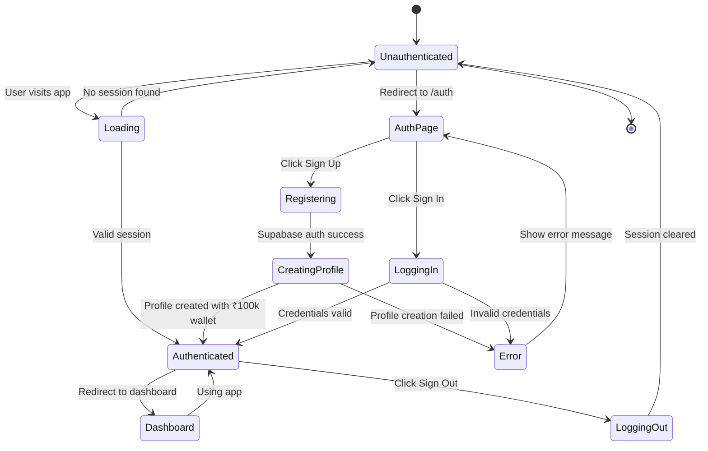
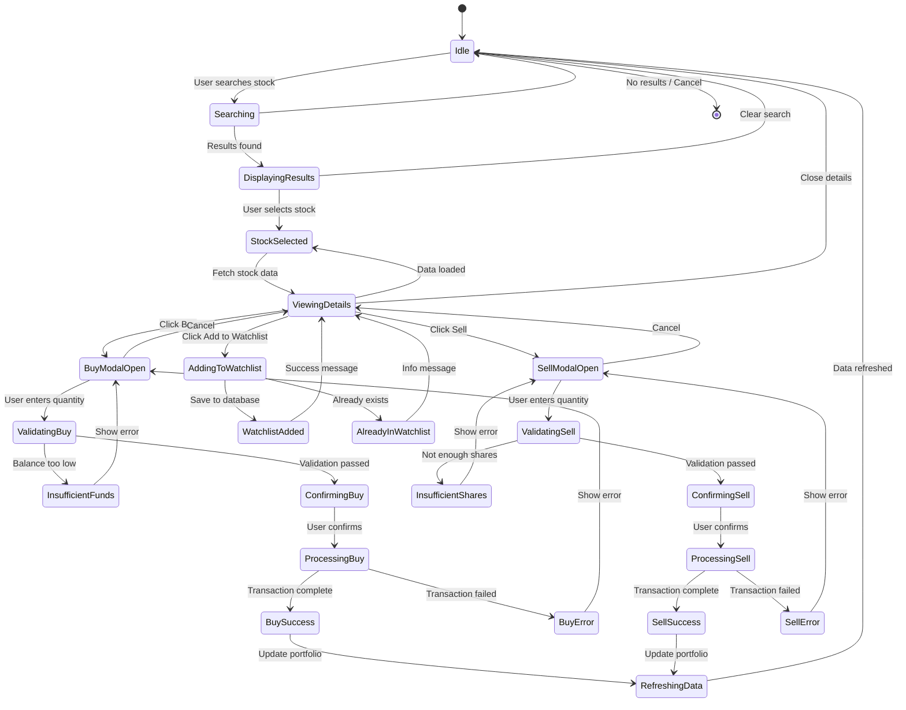
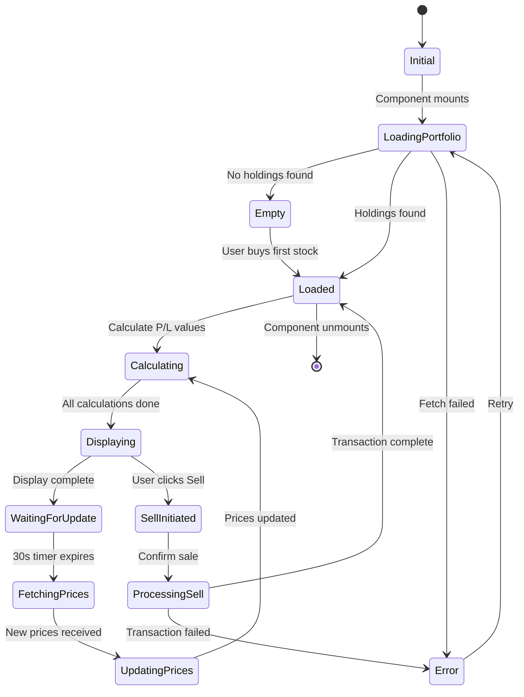
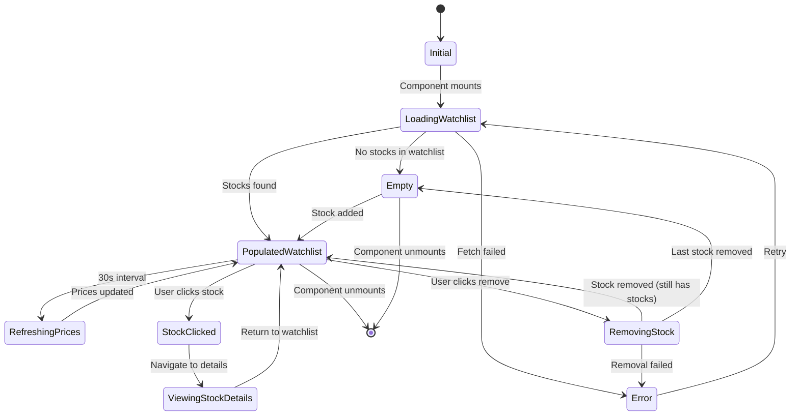
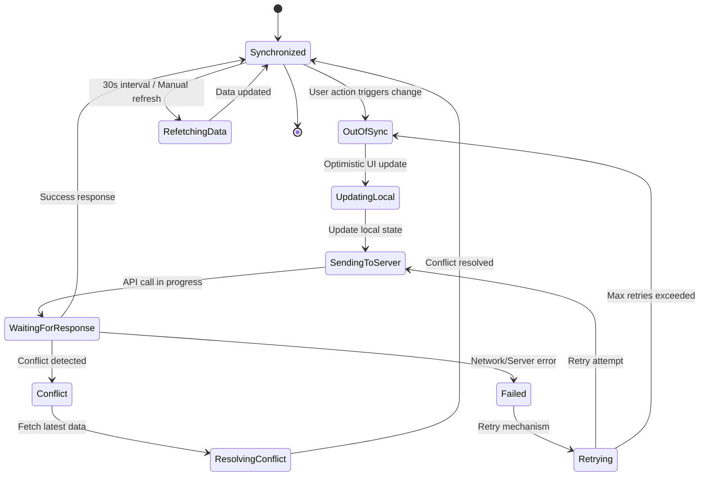

# State Diagrams

## 1. Authentication State Diagram

## 2. Stock Trading State Diagram

## 3. Portfolio Update State Diagram

## 4. Watchlist State Diagram

## 5. Data Synchronization State Diagram

