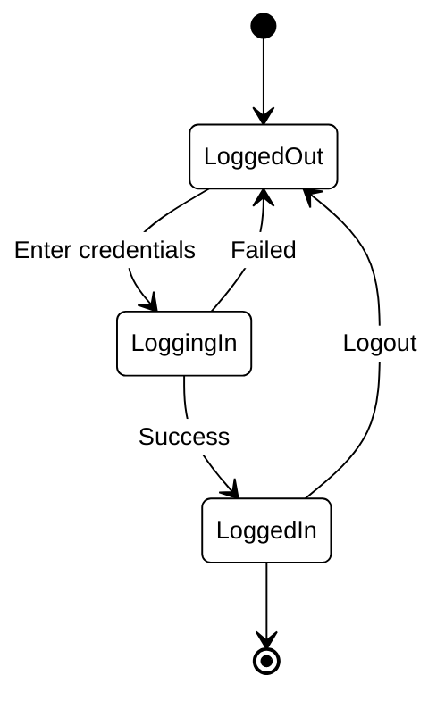
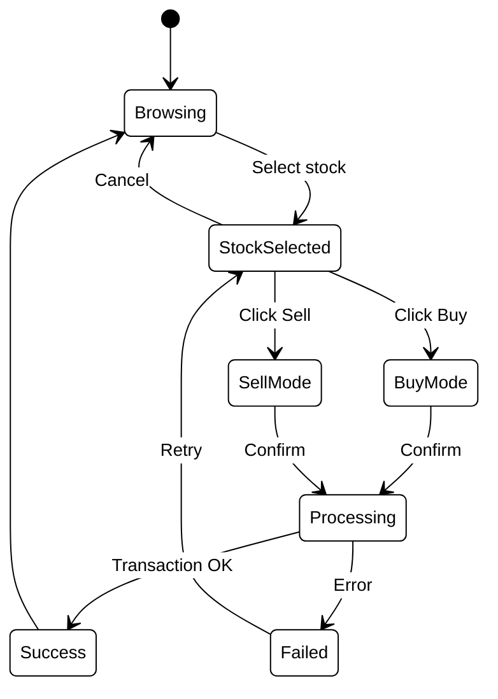
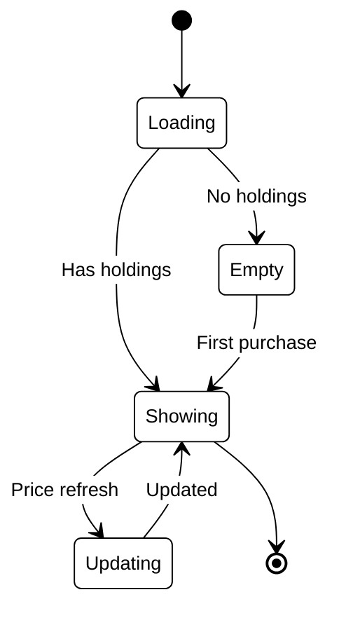

# State Diagrams

## 1. User Authentication States

```mermaid
%%{init: {'theme':'base', 'themeVariables': {'primaryColor':'#fff','primaryTextColor':'#000','primaryBorderColor':'#000','lineColor':'#000','fontSize':'14px'}}}%%
stateDiagram-v2
    [*] --> LoggedOut
    LoggedOut --> LoggingIn: Enter credentials
    LoggingIn --> LoggedIn: Success
    LoggingIn --> LoggedOut: Failed
    LoggedIn --> LoggedOut: Logout
    LoggedIn --> [*]
```

## 2. Stock Trading States

```mermaid
%%{init: {'theme':'base', 'themeVariables': {'primaryColor':'#fff','primaryTextColor':'#000','primaryBorderColor':'#000','lineColor':'#000','fontSize':'14px'}}}%%
stateDiagram-v2
    [*] --> Browsing
    Browsing --> StockSelected: Select stock
    StockSelected --> BuyMode: Click Buy
    StockSelected --> SellMode: Click Sell
    BuyMode --> Processing: Confirm
    SellMode --> Processing: Confirm
    Processing --> Success: Transaction OK
    Processing --> Failed: Error
    Success --> Browsing
    Failed --> StockSelected: Retry
    StockSelected --> Browsing: Cancel
```

## 3. Portfolio States

```mermaid
%%{init: {'theme':'base', 'themeVariables': {'primaryColor':'#fff','primaryTextColor':'#000','primaryBorderColor':'#000','lineColor':'#000','fontSize':'14px'}}}%%
stateDiagram-v2
    [*] --> Loading
    Loading --> Empty: No holdings
    Loading --> Showing: Has holdings
    Empty --> Showing: First purchase
    Showing --> Updating: Price refresh
    Updating --> Showing: Updated
    Showing --> [*]
```
