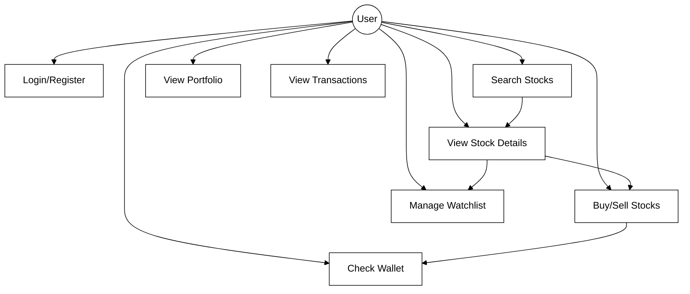

# Use Case Diagram

This diagram shows the various use cases and actors in the Fingrow platform.

## Use Case Descriptions

### User Use Cases
- **UC1: Login/Register** - User authenticates or creates new account
- **UC2: View Dashboard** - User views main dashboard with overview
- **UC3: Search Stocks** - User searches for stocks by symbol or name
- **UC4: View Stock Details** - User views detailed information about a stock
- **UC5: Buy Stocks** - User purchases shares of a stock
- **UC6: Sell Stocks** - User sells shares from portfolio
- **UC7: View Portfolio** - User views their stock holdings
- **UC8: Add to Watchlist** - User adds stock to watchlist for monitoring
- **UC9: Remove from Watchlist** - User removes stock from watchlist
- **UC10: View Wallet Balance** - User checks available funds
- **UC11: View Transaction History** - User reviews past transactions
- **UC12: View Market News** - User reads latest market news
- **UC13: View Top Stocks** - User sees top performing stocks
- **UC14: Track Profit/Loss** - User monitors gains and losses

### System Use Cases
- **UC15: Real-time Price Updates** - System automatically updates stock prices every 30 seconds
